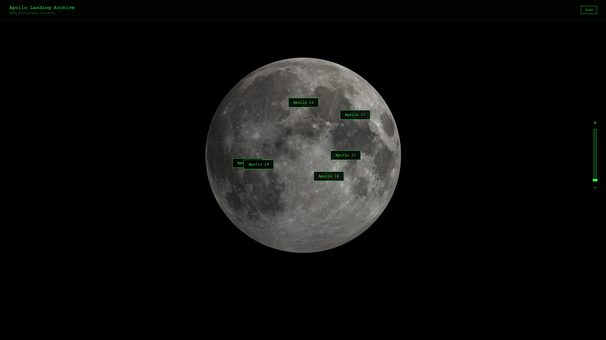

¨SUPSI 2026  
Corso d’interaction design, CV429.01  
Docenti: A. Gysin, G. Profeta  

Progetto 1: La conquista dello spazio

# Apollo Landing Archive
Autore: Daniele Falcone \
[Apollo Landing Archive](https://dadiccs.github.io/nasa/)


## Introduzione e tema
Il progetto consiste in un archivio cartografico ed esplorativo interattivo 3D dedicato alle storiche missioni lunari Apollo della NASA. L'obiettivo è centralizzare e rendere accessibile il database fotografico delle stazioni di allunaggio attraverso un'esperienza web immersiva a due livelli di profondità: una visualizzazione macro, in cui l'utente interagisce con un modello tridimensionale della Luna per localizzare geograficamente le missioni, e una visualizzazione micro (Street View), che permette di calarsi direttamente sul suolo lunare navigando all'interno delle fotosfere storiche a terra.

## Riferimenti progettuali
Il principale riferimento concettuale e tecnico è rappresentato dal sistema di navigazione di Google Earth e, in particolare, dalla gestione delle sue fotosfere. Il progetto analizza il modo in cui l'utente interagisce con immagini panoramiche e superfici sferiche, cercando di replicare quel senso di immersività e continuità visiva. 

## Design dell’interfaccia e modalità di interazione
L’interfaccia adotta un'estetica tecnica e monocromatica in verde fosforo su fondo nero con caratteri a spaziatura fissa strutturandosi su tre livelli di zoom progressivi che permettono prima di ruotare liberamente il modello 3D della Luna orientando la telecamera verso i siti Apollo selezionati poi di attivare i vettori di allunaggio al superamento di una soglia critica e infine di accedere al massimo zoom a una fotosfera panoramica dove navigare l'ambiente attraverso hotspot informativi e menu dedicati alle diverse stazioni fotografiche

[]()

## Tecnologia usata
Il sistema integra la potenza di calcolo grafico di Three.js con una gestione dinamica del DOM tramite JavaScript (ES6+). L'architettura è progettata per gestire il passaggio fluido tra l'ambiente 3D e il visualizzatore di immagini ad alta risoluzione attraverso i seguenti pilastri tecnici:

Context Switching: Mediante la manipolazione delle proprietà CSS (display), il sistema disattiva la pipeline di rendering WebGL per dare priorità al visualizzatore di fotosfere, ottimizzando l'uso di memoria e GPU.

Caricamento Dinamico e Reset: Gli asset visivi vengono caricati in modo asincrono. Al completamento del download, i parametri di trasformazione (imgPos, imgScale) vengono resettati per garantire una navigazione coerente e centrata su ogni nuovo sito.

Data Binding: La logica di sistema mappa i metadati estratti dal file di configurazione (coordinate geografiche e titoli delle missioni) direttamente nell'interfaccia utente, fornendo informazioni scientifiche in tempo reale.


```JavaScript
function enterStreetView(cfg) {
    // 1. Switch dell'interfaccia
    document.getElementById('canvas-container').style.display = 'none';
    document.getElementById('panorama').style.display = 'block';
    
    // 2. Caricamento dinamico dell'asset lunare
    const imgEl = document.getElementById('lunar-img');
    imgEl.src = cfg.file;
    
    // 3. Reset dei parametri di navigazione dell'immagine
    imgEl.onload = () => { 
        imgPos = 0; 
        imgScale = 1; 
        updateImgTransform(); 
    };
    
    // 4. Popolamento dei metadati della missione
    document.getElementById('d-id').innerText = cfg.titolo;
    document.getElementById('d-coords').innerText = `${cfg.lat.toFixed(3)}N / ${cfg.lon.toFixed(3)}E`;
}
```

## Target e contesto d’uso
Il progetto è rivolto a un pubblico trasversale di appassionati dello spazio, della NASA e delle storiche missioni Apollo. Grazie a un'interfaccia immediata, lo strumento è accessibile a chiunque desideri esplorare i siti di allunaggio in modo immersivo.

Il contesto d'uso ideale riguarda la divulgazione scientifica e i musei digitali, offrendo a ogni utente l'esperienza di navigare nell'archivio lunare come un operatore di missione.

